\# 📲 Zone Check – Attendance App


Zone Check is a Flutter-based smart attendance app designed for teachers and students. It tracks student attendance based on proximity to the teacher using real-time location. 


---


\## 📌 Features


\- 📍 \*\*Location-Based Attendance\*\*  

\- 👨‍🏫 \*\*Separate Dashboards\*\* for Students, Teachers, and Admin  

\- 📊 \*\*Attendance Reports\*\* (Daily, Weekly, Between Dates)  

\- 🧑‍🎓 \*\*Student Auto-Enrollment in Subjects\*\*  

\- ✅ \*\*Firebase Authentication + Email Verification\*\*  

\- 🔐 \*\*Role-Based Login (Student/Teacher/Admin)\*\*  

\- 🗂️ \*\*Real-Time Database Integration\*\*  

\- 🧭 \*\*Track Student Radius (50-100m)\*\*  

\- 🖼️ \*\*Image-Based Student Identification\*\*  

\- 🌐 \*\*Responsive and Modern UI\*\*  


---


\## 📸 App Screenshots

## App Screenshots

| Screen Name                | Preview |
|---------------------------|---------|
| asking_date_for_report    |  |
| asking_Report             | 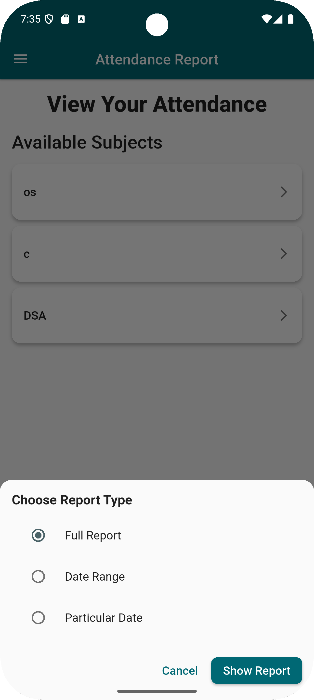 |
| attendance_report_Student | 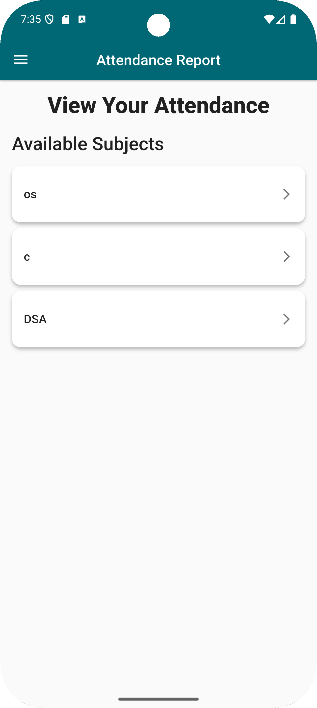 |
| drawer                    |  |
| email_verification_page   | 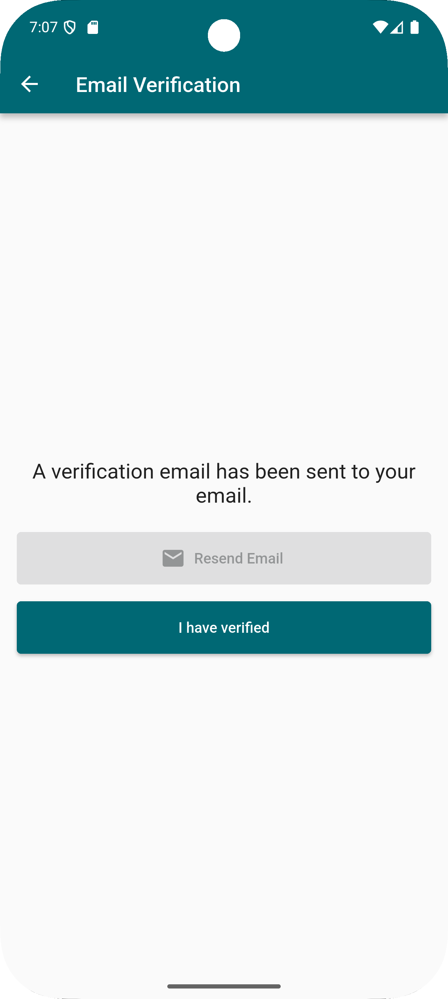 |
| forgot_password           | 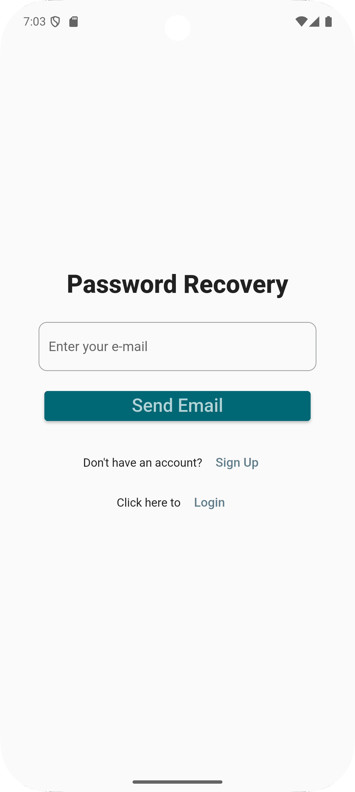 |
| location_permission       | 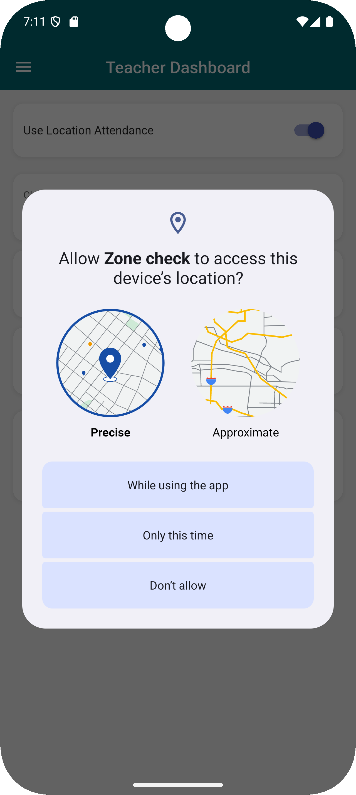 |
| login_page                | 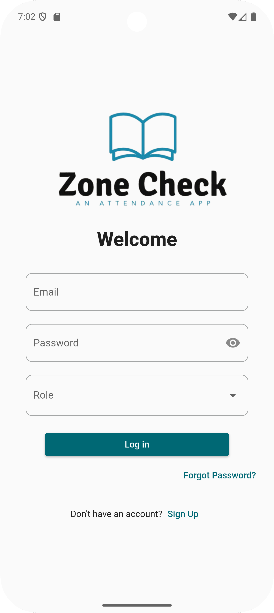 |
| manage_subjects           | 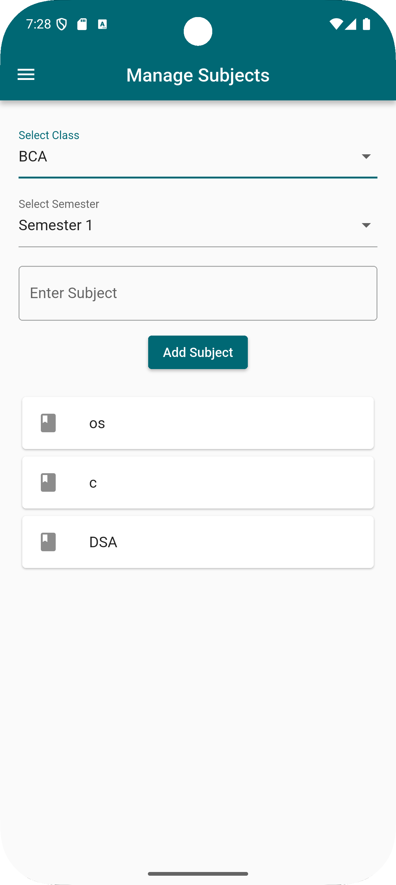 |
| profile_page              | 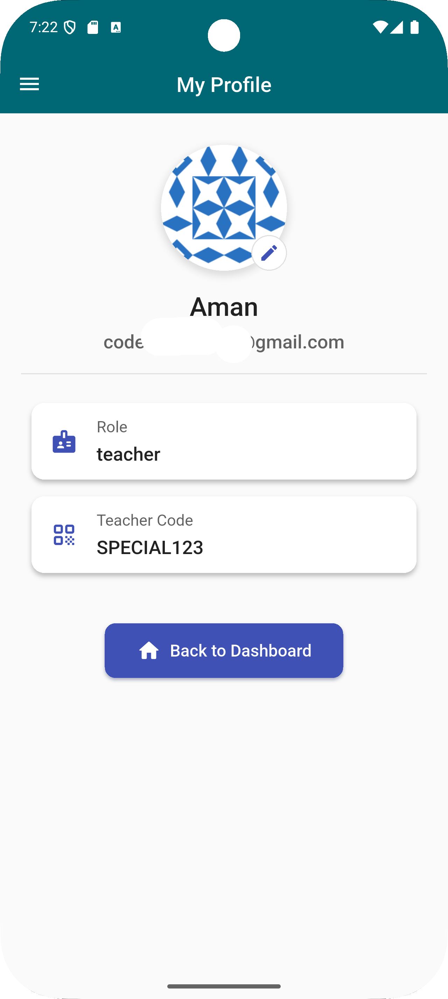 |
| profile_pic_gravater      | 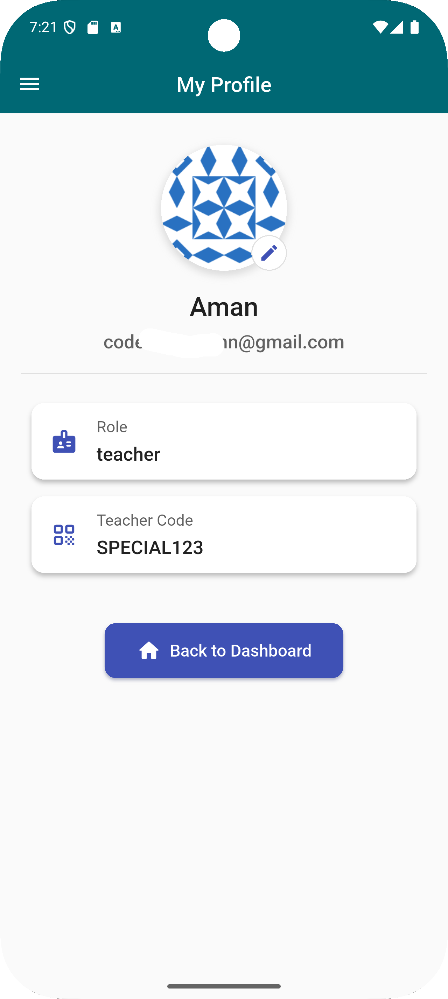 |
| profile_pic_options       | 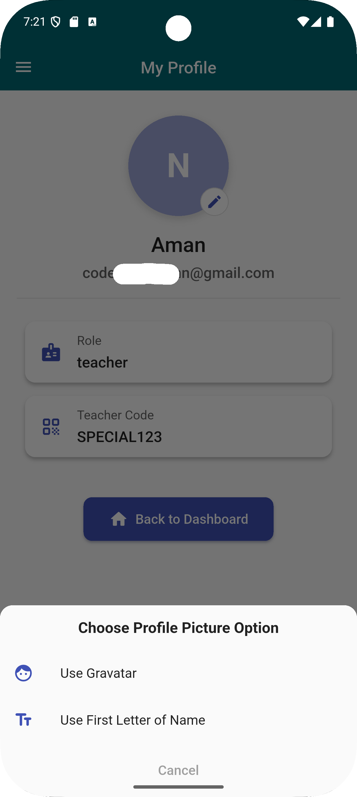 |
| report_for_student        | 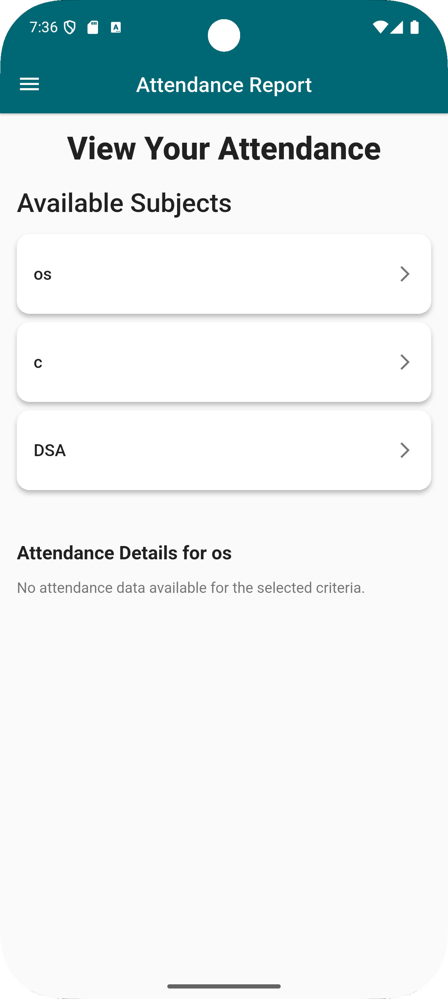 |
| report_whole              | 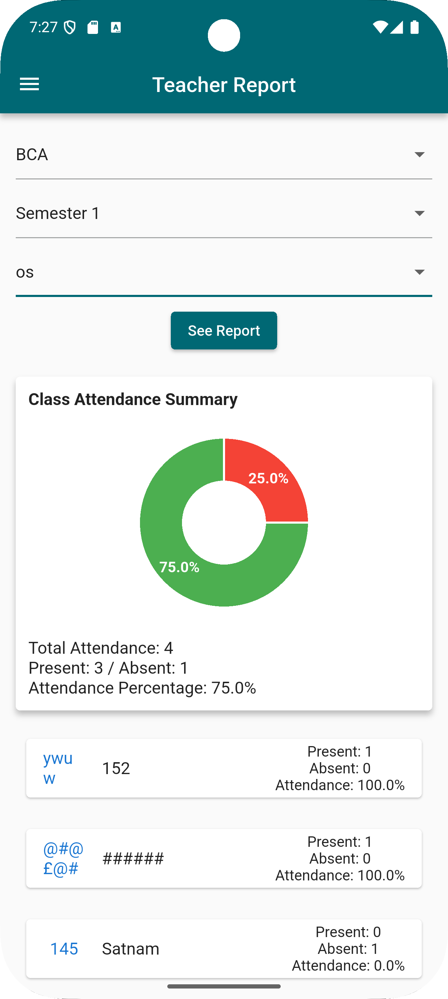 |
| signup_page               | 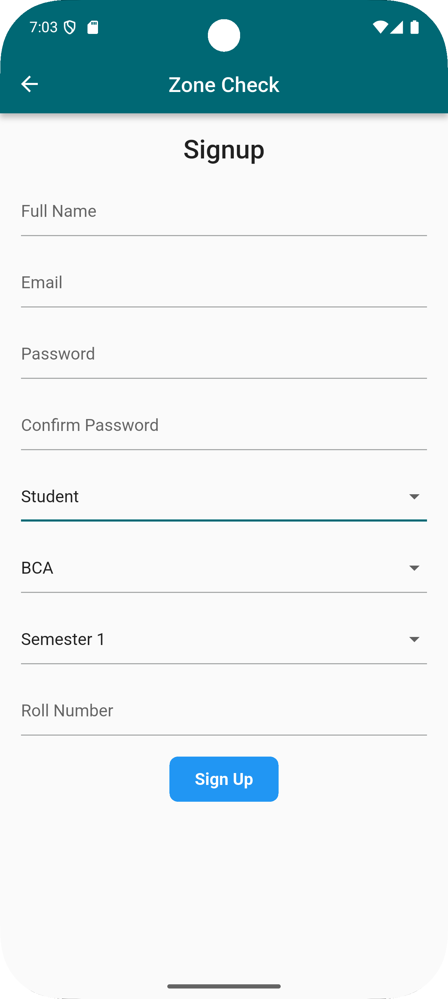 |
| splash_screen             | 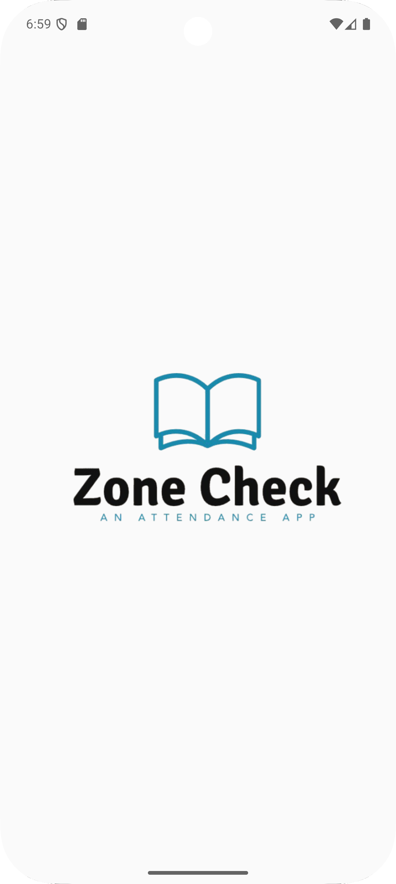 |
| student_dashboard         | 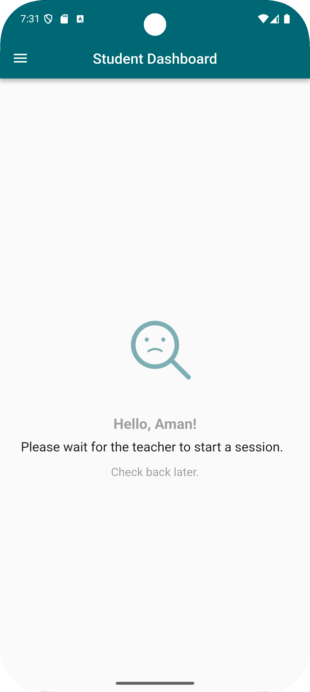 |
| student_profile           |  |
| student_report            |  |
| teacher_dashboard         | 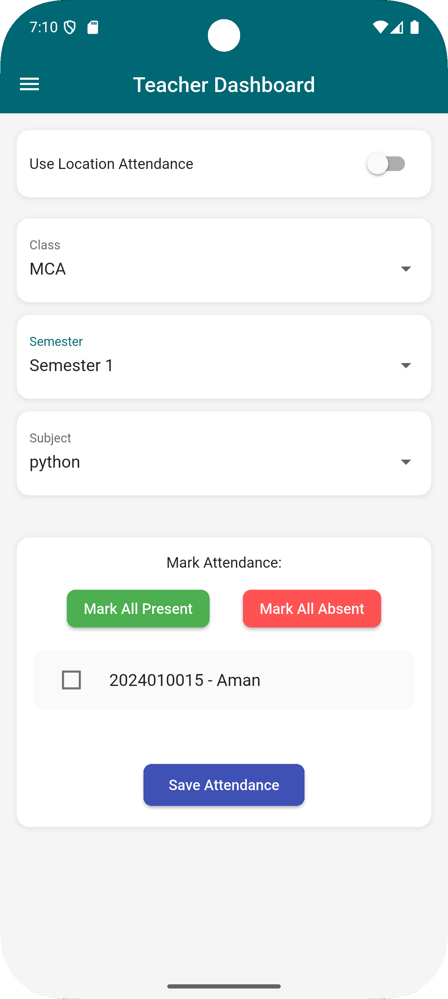 |
| teacher_dashboard_2       | 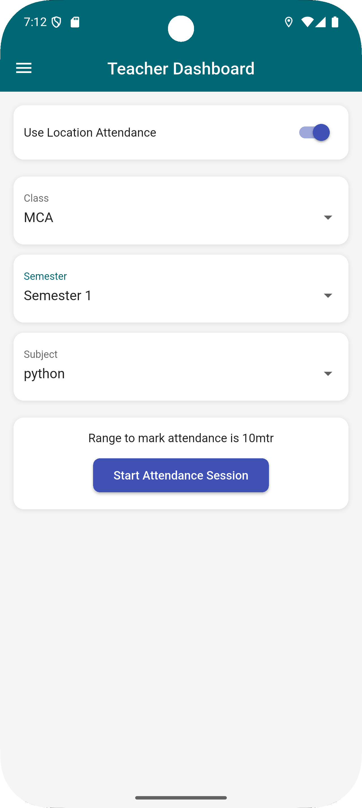 |


\## 🔧 Tech Stack


\- ✅ Flutter

\- 🔥 Firebase Authentication

\- 💾 Firebase Realtime Database

\- 🌍 Geolocator Package

\- 📱 Responsive Flutter UI

\- 📦 Provider/Bloc (Optional for state management)


---


\## 🚀 How to Run


1\. Clone the repository  

&nbsp;  ```bash

&nbsp;  git clone https://github.com/amandeep8680/Attendance\_App-Zone\_Check-.git

Navigate to project


bash

Copy code

cd Attendance\_App-Zone\_Check-

Install dependencies


bash

Copy code

flutter pub get

Run the app


bash

Copy code

flutter run


🧑‍💻 Developed By

Amandeep Singh

📧 Email: codewithamann@gmail.com

🔗 GitHub: amandeep8680


⭐ License

This project is licensed under the MIT License.


---


✅ \*\*Next Steps\*\*:

1\. Create a folder `assets/screenshots/` in your project root.  

2\. Put all images (like splash, login, dashboard, etc.) inside that folder.  

3\. Add the image paths in your `pubspec.yaml` under `flutter > assets:` like this:


```yaml

flutter:

&nbsp; assets:

&nbsp;   - assets/screenshots/


